# 容量管理设计

<!-- TOC -->

- [容量管理设计](#%E5%AE%B9%E9%87%8F%E7%AE%A1%E7%90%86%E8%AE%BE%E8%AE%A1)
    - [背景](#%E8%83%8C%E6%99%AF)
        - [IT新基建提升资源使用率](#it%E6%96%B0%E5%9F%BA%E5%BB%BA%E6%8F%90%E5%8D%87%E8%B5%84%E6%BA%90%E4%BD%BF%E7%94%A8%E7%8E%87)
        - [现状](#%E7%8E%B0%E7%8A%B6)
    - [目标](#%E7%9B%AE%E6%A0%87)
        - [成本控制](#%E6%88%90%E6%9C%AC%E6%8E%A7%E5%88%B6)
        - [业务支撑](#%E4%B8%9A%E5%8A%A1%E6%94%AF%E6%92%91)
    - [容量管理分类](#%E5%AE%B9%E9%87%8F%E7%AE%A1%E7%90%86%E5%88%86%E7%B1%BB)
        - [通用容量管理过程](#%E9%80%9A%E7%94%A8%E5%AE%B9%E9%87%8F%E7%AE%A1%E7%90%86%E8%BF%87%E7%A8%8B)
        - [分类](#%E5%88%86%E7%B1%BB)
    - [服务容量管理](#%E6%9C%8D%E5%8A%A1%E5%AE%B9%E9%87%8F%E7%AE%A1%E7%90%86)
        - [服务管理的过程](#%E6%9C%8D%E5%8A%A1%E7%AE%A1%E7%90%86%E7%9A%84%E8%BF%87%E7%A8%8B)
        - [规划服务管理](#%E8%A7%84%E5%88%92%E6%9C%8D%E5%8A%A1%E7%AE%A1%E7%90%86)
            - [标签](#%E6%A0%87%E7%AD%BE)
        - [服务容量的持续管理](#%E6%9C%8D%E5%8A%A1%E5%AE%B9%E9%87%8F%E7%9A%84%E6%8C%81%E7%BB%AD%E7%AE%A1%E7%90%86)
            - [服务容量的实施过程](#%E6%9C%8D%E5%8A%A1%E5%AE%B9%E9%87%8F%E7%9A%84%E5%AE%9E%E6%96%BD%E8%BF%87%E7%A8%8B)
            - [服务容量的监控过程](#%E6%9C%8D%E5%8A%A1%E5%AE%B9%E9%87%8F%E7%9A%84%E7%9B%91%E6%8E%A7%E8%BF%87%E7%A8%8B)
            - [服务容量的分析过程](#%E6%9C%8D%E5%8A%A1%E5%AE%B9%E9%87%8F%E7%9A%84%E5%88%86%E6%9E%90%E8%BF%87%E7%A8%8B)
            - [服务容量的调优过程](#%E6%9C%8D%E5%8A%A1%E5%AE%B9%E9%87%8F%E7%9A%84%E8%B0%83%E4%BC%98%E8%BF%87%E7%A8%8B)
        - [自动化容量规划工具](#%E8%87%AA%E5%8A%A8%E5%8C%96%E5%AE%B9%E9%87%8F%E8%A7%84%E5%88%92%E5%B7%A5%E5%85%B7)
    - [资源容量管理](#%E8%B5%84%E6%BA%90%E5%AE%B9%E9%87%8F%E7%AE%A1%E7%90%86)
        - [规划资源容量管理](#%E8%A7%84%E5%88%92%E8%B5%84%E6%BA%90%E5%AE%B9%E9%87%8F%E7%AE%A1%E7%90%86)
        - [资源容量管理的过程](#%E8%B5%84%E6%BA%90%E5%AE%B9%E9%87%8F%E7%AE%A1%E7%90%86%E7%9A%84%E8%BF%87%E7%A8%8B)
        - [资源容量管理的规划和实施](#%E8%B5%84%E6%BA%90%E5%AE%B9%E9%87%8F%E7%AE%A1%E7%90%86%E7%9A%84%E8%A7%84%E5%88%92%E5%92%8C%E5%AE%9E%E6%96%BD)
        - [资源容量管理的监控](#%E8%B5%84%E6%BA%90%E5%AE%B9%E9%87%8F%E7%AE%A1%E7%90%86%E7%9A%84%E7%9B%91%E6%8E%A7)
        - [资源容量管理的分析](#%E8%B5%84%E6%BA%90%E5%AE%B9%E9%87%8F%E7%AE%A1%E7%90%86%E7%9A%84%E5%88%86%E6%9E%90)
            - [混合部署](#%E6%B7%B7%E5%90%88%E9%83%A8%E7%BD%B2)
            - [扩容](#%E6%89%A9%E5%AE%B9)
            - [缩容](#%E7%BC%A9%E5%AE%B9)
            - [基本参数调优](#%E5%9F%BA%E6%9C%AC%E5%8F%82%E6%95%B0%E8%B0%83%E4%BC%98)
        - [资源容量管理的调优](#%E8%B5%84%E6%BA%90%E5%AE%B9%E9%87%8F%E7%AE%A1%E7%90%86%E7%9A%84%E8%B0%83%E4%BC%98)
            - [混合部署](#%E6%B7%B7%E5%90%88%E9%83%A8%E7%BD%B2)
            - [扩容](#%E6%89%A9%E5%AE%B9)
            - [回收](#%E5%9B%9E%E6%94%B6)
    - [逻辑集群](#%E9%80%BB%E8%BE%91%E9%9B%86%E7%BE%A4)
    - [业务容量管理（租户）](#%E4%B8%9A%E5%8A%A1%E5%AE%B9%E9%87%8F%E7%AE%A1%E7%90%86%E7%A7%9F%E6%88%B7)
        - [卡点](#%E5%8D%A1%E7%82%B9)
    - [成本](#%E6%88%90%E6%9C%AC)
        - [成本预算](#%E6%88%90%E6%9C%AC%E9%A2%84%E7%AE%97)
        - [成本分析](#%E6%88%90%E6%9C%AC%E5%88%86%E6%9E%90)
    - [基础能力](#%E5%9F%BA%E7%A1%80%E8%83%BD%E5%8A%9B)
        - [变更的风险控制](#%E5%8F%98%E6%9B%B4%E7%9A%84%E9%A3%8E%E9%99%A9%E6%8E%A7%E5%88%B6)
        - [针对服务的能力](#%E9%92%88%E5%AF%B9%E6%9C%8D%E5%8A%A1%E7%9A%84%E8%83%BD%E5%8A%9B)
            - [扩容](#%E6%89%A9%E5%AE%B9)
            - [缩容](#%E7%BC%A9%E5%AE%B9)
            - [迁移](#%E8%BF%81%E7%A7%BB)
            - [下线](#%E4%B8%8B%E7%BA%BF)
        - [针对资源的能力](#%E9%92%88%E5%AF%B9%E8%B5%84%E6%BA%90%E7%9A%84%E8%83%BD%E5%8A%9B)
            - [逻辑集群扩容](#%E9%80%BB%E8%BE%91%E9%9B%86%E7%BE%A4%E6%89%A9%E5%AE%B9)
            - [逻辑集群缩容](#%E9%80%BB%E8%BE%91%E9%9B%86%E7%BE%A4%E7%BC%A9%E5%AE%B9)
            - [物理集群扩容](#%E7%89%A9%E7%90%86%E9%9B%86%E7%BE%A4%E6%89%A9%E5%AE%B9)
            - [物理集群缩容](#%E7%89%A9%E7%90%86%E9%9B%86%E7%BE%A4%E7%BC%A9%E5%AE%B9)
        - [针对管控的能力](#%E9%92%88%E5%AF%B9%E7%AE%A1%E6%8E%A7%E7%9A%84%E8%83%BD%E5%8A%9B)
            - [多集群管理](#%E5%A4%9A%E9%9B%86%E7%BE%A4%E7%AE%A1%E7%90%86)
            - [自适应调度（自动化容量规划工具提供算法）](#%E8%87%AA%E9%80%82%E5%BA%94%E8%B0%83%E5%BA%A6%E8%87%AA%E5%8A%A8%E5%8C%96%E5%AE%B9%E9%87%8F%E8%A7%84%E5%88%92%E5%B7%A5%E5%85%B7%E6%8F%90%E4%BE%9B%E7%AE%97%E6%B3%95)
        - [自动化容量规划工具](#%E8%87%AA%E5%8A%A8%E5%8C%96%E5%AE%B9%E9%87%8F%E8%A7%84%E5%88%92%E5%B7%A5%E5%85%B7)
    - [参考资料](#%E5%8F%82%E8%80%83%E8%B5%84%E6%96%99)

<!-- /TOC -->

## 背景

### IT新基建提升资源使用率

IT新基建提升资源使用率的背景下，需要不断提升服务器、容器资源使用率，排除一些例外规则（如高可用等），整体资源使用率

### 现状

- 没有对整体容量资产分部、剩余容量占比、容量趋势及容量预警进行展示
- 容量规划无依据，新系统上线、IT资源扩容无预测分析手段
- 缺乏业务和系统视角的容量指标体系，无法准确反映业务和系统所分配的IT资源
- 缺乏当前容量资源与业务需求相匹配的分析手段；容量采集手段混乱无序，指标体系不完善，管理规范化不足。
- 资源分配易，回收难，造成容量实际利用率远低于当前值
- 没有可靠的成本分析途径

## 目标

- 减少资源浪费
- 高效的资源利用
- 支持服务水平监控和管理
- 工作负载管理
- 预测基础设计增长

### 成本控制

容量主动管理和优化，降低IT资源投入

确保最佳资源利用率、性能和成本

### 业务支撑

预测业务增长，容量自适应

## 容量管理分类

### 通用容量管理过程

[//]: # (![通用容量管理过程]&#40;容量管理通用流程.jpg&#41;)
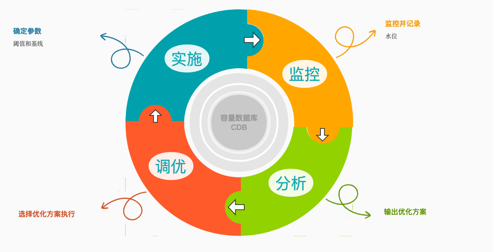

容量管理是一个循环的过程，每个完整的过程执行结束，都需要根据调整后的容量信息重新定义阈值和基线

- 实施：可以结合现有规范，设置合适的初始参数
- 监控：监控是一个持续性的过程，可以结合现有的监控服务，采集需要的数据
- 分析：可以结合现有规范，通过一些算法分析各种优化建议
- 调优：对于调优报告，可以提交到现有的变更管理系统（如果有），通过标准流程进行变更，同时反馈对调优报告的处理，优化后续的调优报告生成

容量管理的调优过程需要基础功能的支持，后续部分详述

### 分类

容量管理主要分服务容量管理、资源容量管理、业务容量管理，过程描述如下：

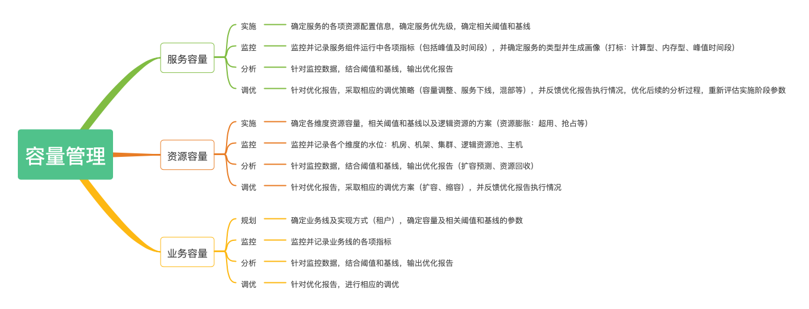

## 服务容量管理

### 服务管理的过程

服务容量的管理存在于服务的整个生命周期

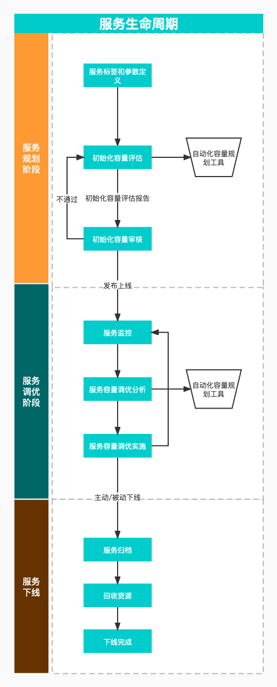

- 规划服务管理
- 服务容量的持续管理

### 规划服务管理

上线容量初始化过程：

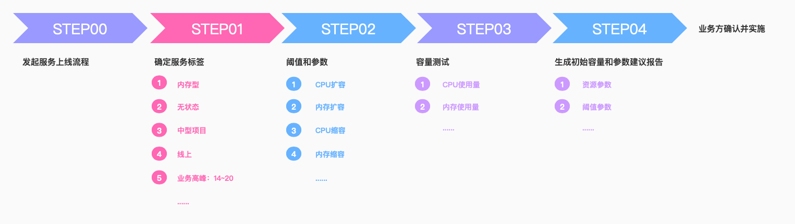

#### 标签

预设标签，为初始容量和选区提供参考

| 标签    | 说明                                   | 备注                                                                               |
|-------|--------------------------------------|----------------------------------------------------------------------------------|
| 资源类型  | cpu密集型、内存型、综合性                       | 离线计算、跑批任务； 缓存服务                                                                  |
| 是否有状态 | 服务是否有状态                              | 是、否                                                                              |
| 业务高峰段 | 时间段：[14,15,16,17]                    | 如线上业务业务高峰期主要在白天，而离线计算高峰期主要在凌晨                                                    |
| 业务低峰段 | 时间段：[0,1,2,3,4,5]                    |                                                                                  |
| 服务规模  | 小型，中型，大型：small、middle、large          |                                                                                  |
| 服务环境  | test,uat,prod                        |                                                                                  |
| 峰值灵活性 | 1、2、3                                |                                                                                  |
| 容量级别  | 低、中、高                                |                                                                                  |
| 服务质量  | 低中高优：BestEffort、Burstable、Guaranteed | https://kubernetes.io/zh/docs/tasks/configure-pod-container/quality-service-pod/ |

服务的以上标签，可在分析过程中不断更正和优化

*服务容量测试*

    现有规范：在新服务上线时需出具相关的测试报告

服务在上线前，测试不同并发等情况的资源消耗，进一步校准标签

针对不同类型的服务，规划合适的维度，用于监控

| 服务类型   | 参考维度          |
|--------|---------------|
| 数据库    | 存储、CPU、内存、连接数 |
| WEB服务  | CPU、内存，QPS，流量 |
| 缓存     |               |
| 消息队列   |               |
| ...... |               |

应该为不同类型的应用配置默认的阈值模板，再通过标签自动生成阈值的默认值，
因为不同标签的应用，即使类型相同，也应有不同的阈值配置（如Guaranteed级别的服务阈值应该更加保守）

当容量水位达到指定的指标需触发一定的操作

| 阈值     | 说明   | 备注   |
|--------|------|------|
| cpu    | 基线90 | 扩容   |
| cpu    | 基线80 | 扩容预警 |
| cpu    | 基线30 | 缩容预警 |
| cpu    | 基线20 | 缩容   |
| ...... |      |      |

### 服务容量的持续管理

#### 服务容量的实施过程

根据规划的相关标签和参数，自动生成初始容量用于初次部署

根据标签，评估应用的基线容量要求，实际可通过标签配置对应的模板，自动生成初始基线数据，输入如下

根据服务的类型和性质，估算各类资源的用量，并输出服务容量计划表

| 类别     | 数量      |     |
|--------|---------|-----|
| CPU    | 2000m   |     |
| 内存     | 2048Mi  |     |
| 存储     | 100Gi   |     |
| 副本数    | 2       |     |
| ...... |         |     |

#### 服务容量的监控过程

监控是一个持续的过程

针对不同类型的服务，监控各个维度的指标

收集和记录服务的各项指标水位

- 历史变化的水位线
- 水位线区间：高峰、低峰、平峰，按日、周、月、年、工作日、休息日
- 水位线高峰值、低峰值，按日、周、月、年、工作日、休息日
- 各水位线间的比值

*服务水位*

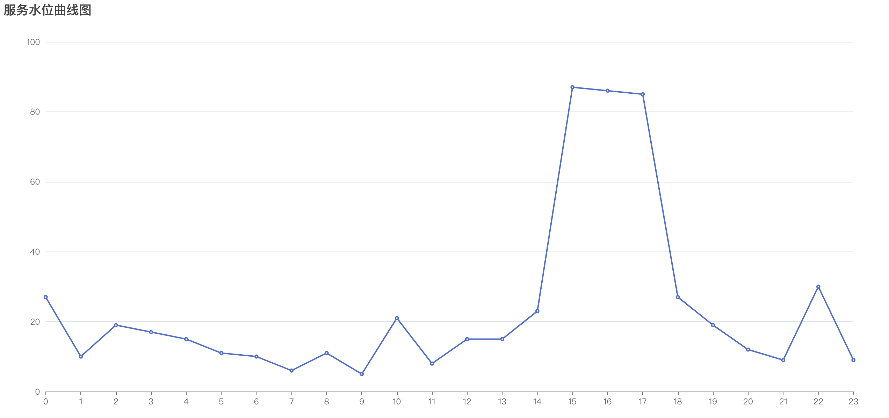

*峰值时段散点图*

#### 服务容量的分析过程

针对服务的阈值和基线，结合监控数据，通过适当的算法输出服务容量优化报告

*参数调整*

服务的初始参数，由于参考数据不足，可能存在参数设定不对或不准确

针对监控数据，对服务的标签和参数输出建设性的调整报告

*扩容*

对于容量的增长预测，如果短期内水位可能会突破阈值，输出扩容建议报告

*缩容*

如果水位长期位于地位，且峰值水位也较低，输出缩容建议报告

*下线*

如果监控中某些数据表示服务已经停用，则给出相关数据并输出下线报告

#### 服务容量的调优过程

针对优化报告，审核调优参数

反馈调优报告的有效性，优化调优报告的生成

根据当前状态，生成新的阈值和基线，审核通过后执行

调优依赖于基础功能的实现

*参数更新*

更新服务的标签、阈值等参数

*缩容*

缩容分横向缩容和纵向缩容

- 横向缩容：减少服务的副本数
- 纵向缩容：降低服务的配置

*扩容*

扩容同样分横向扩容和纵向扩容

- 横向扩容：增加服务的副本书
- 纵向扩容：增加服务配置

*服务下线*

服务下线可由不同场景触发：

- 主动下线：由业务方主动发起的下线操作，相关资源可以直接回收
- 被动下线：由分析过程而确定服务已不再使用，通知业务方确认并下线

被动下线的触发规则：可结合当前下线规则扩展（7天内流量为0）

| 指标  | 数值  | 说明  |
|-----|-----|-----|
|     |     |     |
|     |     |     |


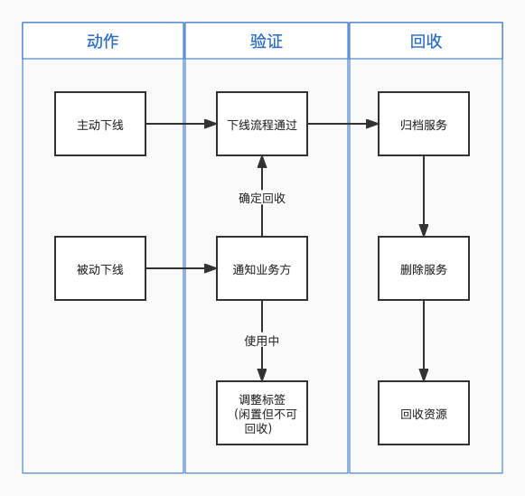

*主动下线流程*

主动下线由业务方主动发起，确认后直接进行容量的回收即可

*被动下线流程*

被动下线需业务方严格校验

如果服务不应下线，则应对服务标签等做相应调整（如增加标签：0流量服务）

如果可以下线，则启动下线流程，完成后回收容量

### 自动化容量规划工具

    根据以上描述，可以抽离出独立的自动化容量规划工具

可分为以下模块：

- 服务数据模块：描述服务的相关数据，用于给初始化服务容量和容量的不断调优提供依据
- 预测模块：每个服务的预测数据，对服务的扩缩容提供建议
- 资源供给信息模块：描述服务的资源信息，对于扩缩容、混部提供支持
- 容量求解模块：根据数据模块和预测模块得到建议的容量值
- 容量执行模块：实施容量的变更

## 资源容量管理

    包括：机房、机架、集群、主机等

### 规划资源容量管理

### 资源容量管理的过程

- 规划资源容量
- 实施容量：确定资源容量，指定合适的阈值和基线
- 监控：监控不容维度的使用率数据，应用的性能数据
    - 使用率数据
    - 性能数据
    - 峰值数据
- 分析：根据监控数据、设置的阈值和基线，分析出具容量优化的方案
    - 容量优化报告
- 调优：根据容量分析执行可行的优化方案，完成后根据新的当前状态实施新的阈值和基线并以此循环
    - 回收
    - 扩容

### 资源容量管理的规划和实施

对于不同级别的容量规模，会定义不同的阈值和基线

执行过程主要是根据当前容量信息定义阈值和基线，这是分析过程的重要参考

| 资源     | 容量    | 基线  | 扩容阈值 | 缩容阈值 |
|--------|-------|-----|------|------|
| CPU    | 488核  | 80% | 70%  | 20%  |
| 内存     | 1024G | 90% | 80%  | 30%  |
| 存储     |       |     |      |      |
| ...... |       |     |      |      |

### 资源容量管理的监控

监控过程主要监控容量的水位（使用率）变化，不同类别的容量有不同维度的评估维度

实时容量表格：

| 机房名称 | 机架数 | 主机数 | cpu容量 | 内存容量 | gpu容量 | cpu预备 | 内存预备容量 | gpu预备容量 | 趋势  |
|------|-----|-----|-------|------|-------|-------|--------|---------|-----|
|      |     |     |       |      |       |       |        |         |     |
|      |     |     |       |      |       |       |        |         |     |

| 机架名称 | 所属机房 | 主机数 | cpu容量 | 内存容量 | gpu容量 | cpu预备 | 内存预备容量 | gpu预备容量 |
|------|------|-----|-------|------|-------|-------|--------|---------|
|      |      |     |       |      |       |       |        |         |

| 物理集群名称 | 所属机房 | 主机数 | cpu容量 | 内存容量 | gpu容量 | cpu预备 | 内存预备容量 | gpu预备容量 |
|--------|------|-----|-------|------|-------|-------|--------|---------|
|        |      |     |       |      |       |       |        |         |

| 主机  | 所属集群 | cpu容量 | 内存容量 | gpu容量 | cpu预备 | 内存预备容量 | gpu预备容量 |
|-----|------|-------|------|-------|-------|--------|---------|
|     |      |       |      |       |       |        |         |

各维度的容量水位：

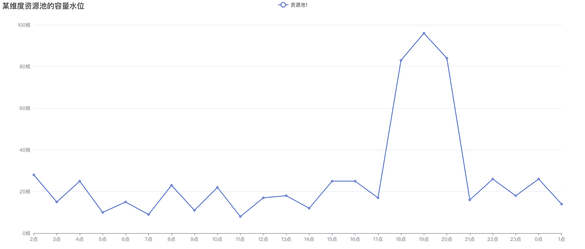

- 峰值水位： 按天、周、月的峰值水位变化图，仅取对应时间段峰值
- 均值水位： 按天、周、月的峰值水位变化图，仅取对应时间段均值

使用服务的堆叠图展示容量的水位更佳

### 资源容量管理的分析

分析容量的水位情况，特别考虑峰值的情况，输出优化报告

报告中可能包含的内容：混合部署建议、扩容建议、缩容建议

#### 混合部署

结合资源容量水位的峰值数据和服务的峰值数据，调整服务的部署

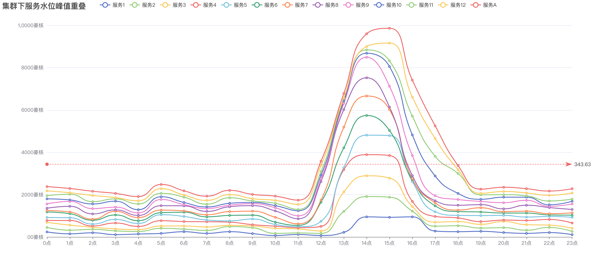

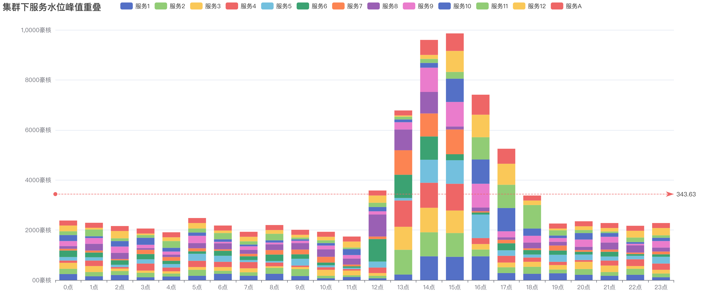

对于使用该资源的服务，服务的峰值应尽量不与资源水位的峰值重叠

典型的：

- 对于跑批（峰值多出现于夜间）和线上服务（峰值多出现于白天），部署到同一资源下是比较合理的方式

- 对于内存型和计算型的服务，也是比较好的混合部署方式

对于峰值与资源水位峰值重叠的服务，可尝试调整服务的实现，如不可调整，则反馈并打标属于峰值不可调整的服务

对于服务的部署（排除特殊需求的服务），根据自身的标签，系统应尽量推荐到合适的资源池中实施（如错峰部署）

对于峰值突出的资源池，可通过服务迁移的方式，与其他资源池平衡峰值

平衡情况：

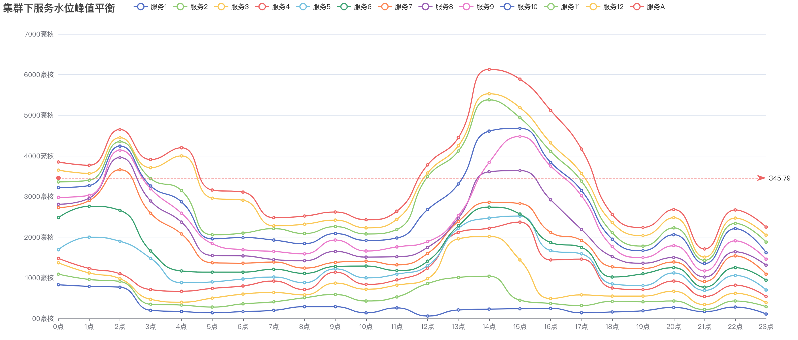

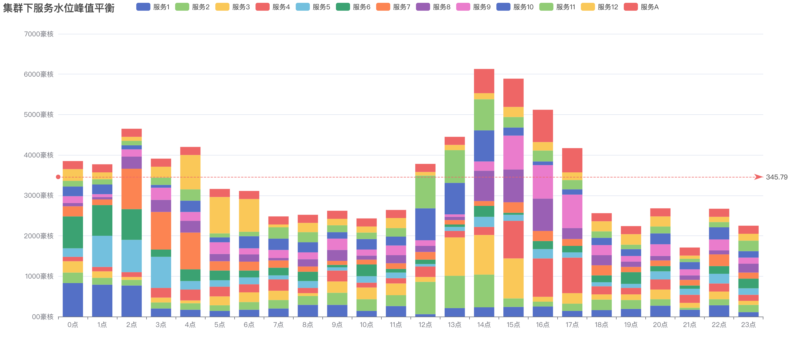

资源的水平峰值有所改善

优化过程：
- 对比同级资源池的水位历史情况
- 以峰值时段分类资源池
- 分好组后的资源池间，是可以相互进行平衡的，在组内资源池选择符合资源池峰值的服务
- 列出各资源池的建议迁移服务（同时可以列出建议建议但迁移受限的服务，比如标签不符，便于进一步的业务优化）
- 输出报告：需包含以上步骤使用的详细数据

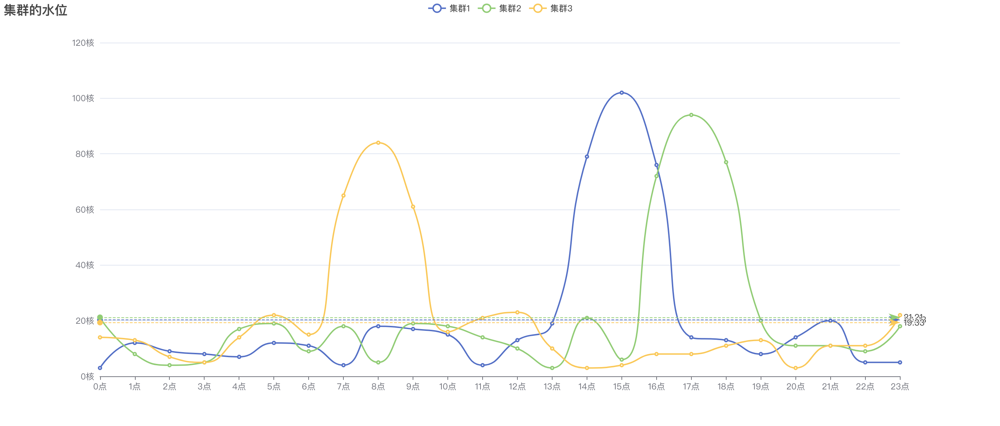

如上，集群3的峰值与1、2错开，可从集群3现在合适的应用与集群1、2交换迁移

#### 扩容

预测资源水位的增长趋势，若短时间内可能会突破阈值，则输出建议扩建报告

扩容主要考虑峰值情况，不稳定总是发生在峰值水位的时候，这时候资源相对紧张

扩容优化报告的输出有两种方式触发：

- 预测容量水位(峰值)将要（比如7天）超过阈值(如80%)
- 容量水位连续(如连续一周峰值)超过阈值(如70%)

#### 缩容

对于水位长期低于缩容阈值，且峰值也不高的情况下，则输出建议缩容报告

#### 基本参数调优

### 资源容量管理的调优

根据分析过程输出的报告，确定是否执行优化建议

完成后重新确认基线和阈值以及相关参数的调整

调优需要走变准的变更流程，涉及到具体业务的，需要业务方确认

#### 混合部署

混合部署主要是平衡不同资源池间的负载波动变化较大的情况，执行时涉及服务的迁移

针对混合部署的优化报告，初期由人工选择要平衡的资源池以及其中要迁移的服务执行，如果方案可行再逐渐替换为自动化执行

#### 扩容

扩容需要给出详细的报告，报告扩容的原因，然后进入变更流程（针对物理集群及以上规模时需要增加主机）

#### 回收

## 逻辑集群

逻辑集群仅作为资源池不同资源类型的区分，在发布服务时提供调度限制或参考

## 业务容量管理（租户）

关于配额：各业务条线对资源的需求本来就有差距，理论上，通过服务容量的管理，租户配额可以不设上限，其下的服务的容量都是规范化管理的

为了整体资源的均衡，可配置配额上限，比如所有租户配额之和不大于总资源容量的2倍

租户的配额使用完时，可根据总租户配额与资源总容量的关系自动增长，当总租户配额超过总资源容量限制（如2倍）时，根据总资源的水位自动调整（增加限制，如2.5倍）

同时提供租户成本核算功能供参考

发布范围限制：通过资源池的label和资源池节点label限制发布范围，租户配置可选择的label

### 卡点

- 配合租户的服务资源申请和配额，现在租户的资源使用不超过配额限制

## 成本

单价配置到资源池CR中，由服务实际所在的资源池和容量计算成本

### 成本预算

### 成本分析

    服务、业务、资源

## 基础能力

### 变更的风险控制

扩缩容、服务迁移、服务下线等更变可能会产生风险，应该走标准的流程处理，评估通过后才可执行

### 针对服务的能力

#### 扩容

- 水平扩容：增加副本数
- 垂直扩容：增加资源配额

选择何种方式主要依据并发的访问数，对于高并发的场景，通过增加副本数的方式水平扩容，对于低并发通过增加资源配额的方式垂直扩容

扩容的实施时间段：

- 对于水平扩容，不影响现有服务，实施的时间段比较自由
- 对于垂直扩容，因为要重启服务，需要在业务低峰实施
 
*应急扩容*

    适用于可预测的短时间扩容需求（如活动等）

- 支持服务在某时间段增加其容量
- 该期间不受自动化容量规划工具影响（不产生缩容）
- 时间段结束后回复之前的容量
- 扩容由上限（比例和绝对值：比如原容量2倍或20c20Gi）

#### 缩容

- 水平扩容：减少副本数（同时限制不应少于保障副本书）
- 垂直扩容：增加资源配额

对于高并发场景，优先选择降低资源配额的垂直缩容，如果副本数已经达到保障数量，则使用水平缩容
对于低并发场景，如果水位线偏低，采取水平缩容，否则使用垂直缩容

缩容的实施时间段：

- 对于水平缩容，不影响现有服务，实施的时间段比较自由
- 对于垂直缩容，因为要重启服务，需要在业务低峰实施

#### 迁移

    为了实现混合部署，需要提供服务的迁移能力，前期仅支持无状态服务的迁移

过程：

- 在目标环境创建相关服务
- 验证服务的可用状态
- 切流：需要注意网络相关的连通性等
- 源环境的服务实例在指定时间后（如3天），下线并回收资源

迁移的实施时间段：

- 在迁移服务的水位低峰时间段实施
- 在源环境和目标滑稽的水位低峰时间段实施

#### 下线

测试环境：


### 针对资源的能力

#### 逻辑集群扩容

#### 逻辑集群缩容

#### 物理集群扩容

#### 物理集群缩容

### 针对管控的能力

#### 多集群管理

解决什么？

- 集群的生命周期管理
- 集群故障感知
- 资源的精细化管理

怎么做？

- 将资源池（物理集群或其他异构资源池）定义为k8s资源
- 跨多资源池的租户体系，统一配额管理

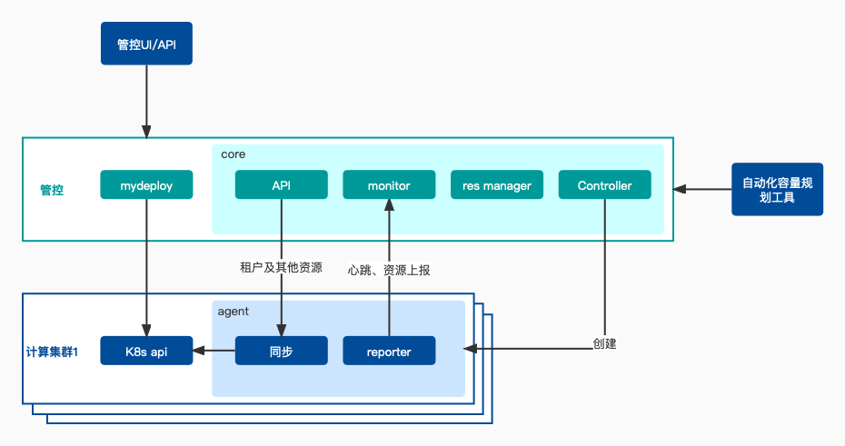

*资源池CRD* ： 资源池CR，资源池节点CR

```
type ResPool struct {
	Spec   ResPoolSpec
	Status ResPoolStatus
}

type ResPoolSpec struct {
    ResPoolType string // k8scluster vmware cloudecs
	KubeConfig []byte 
	KubernetesAPIEndpoint string
	IsMemberCluster bool
	Description string
	HarborAddr string
	NetworkType string
	IngressDomainSuffix string
    // todo 资源单价、节点列表
}

type ResPoolStatus struct {
    State         string // initFailed reconnectedFailed processing deleting healthy unhealthy
    Reason        string
    LastHeartbeat *Time
}

type ResPoolList struct {
	Items []ResPool
}

...... todo：
```

*监视器*

- 负责维护资源池集合的状态，接收reporter的上报数据，提交给资源池管理器

*资源池管理器*

- 维护资源池信息
- 提供服务发布的一级调度选取逻辑：根据服务需求，各资源池状态选区最优资源池

*agent*

- 同步管控资源到资源池（租户等）
- 上报资源池信息变更、心跳

#### 自适应调度（自动化容量规划工具提供算法）

服务在发布时，调度到哪个资源池有如下因素综合决定：

- 服务的硬性要求：如GPU等，只能部署到由服务相关要求的节点的资源池
- 资源池的水位信息：优先选择水位线较低的资源池
- 服务及资源池的标签：尽可能达到峰值水位的均衡(混合部署)

部署到一个还是多个资源池，视服务的要求而定，通常情况下部署到一个物理资源池即可

一级调度由管控 Operator 实现

增强现有 mydeply ，资源池的选取由主观改为自动化容量规划工具推荐

二级调度由资源池自身实现（如k8s集群）

### 自动化容量规划工具

    该工具需接入流程引擎

- 可根据服务的参数和标签，输出服务初始容量建议报告(鉴于当前数据量，适合使用加权的方式生成推荐容量信息)
- watch资源池CR，维护资源池的容量、水位信息、label等相关信息，同时提供整体资源的相关状态
- 周期性的通过监控项目获取数据，分析服务、资源池的容量信息，输出优化建议报告或告警信息
- 优化报告关联上述能力，若优化建议报告审核通过，则执行优化

## 参考资料

[请问IT系统的容量管理应该如何规划 ?](https://www.zhihu.com/question/55363083)

[容量管理](https://zhuanlan.zhihu.com/p/463930536)

[IStorM CM容量管理平台](https://www.hatech.com.cn/h-pd-48.html)

[IStorM CM 容量管理](https://www.hatech.com.cn/h-col-174.html)

[云容量管理和应用](https://cloud.tencent.com/developer/article/1400119)

[云容量管理的重要性以及如何进行](https://www.techtarget.com/searchcloudcomputing/feature/The-importance-of-cloud-capacity-management-and-how-to-do-it#:~:text=Cloud%20capacity%20management%20is%20critical%20to%20an%20effective,that%20waste%20money%20and%20add%20unnecessary%20management%20overhead.)

[Intelligent Cloud Capacity Management]()

[智能云容量管理](https://www.researchgate.net/publication/236335710_Intelligent_Cloud_Capacity_Management)

[https://www.researchgate.net/publication/236335710_Intelligent_Cloud_Capacity_Management](https://www.intel.com/content/dam/www/public/us/en/documents/white-papers/simplifying-private-cloud-capacity-management-paper-l.pdf)

[kubecost](https://github.com/kubecost/cost-model)

[如何在云原生混部场景下利用资源配额高效分配集群资源](https://zhuanlan.zhihu.com/p/504681375)
