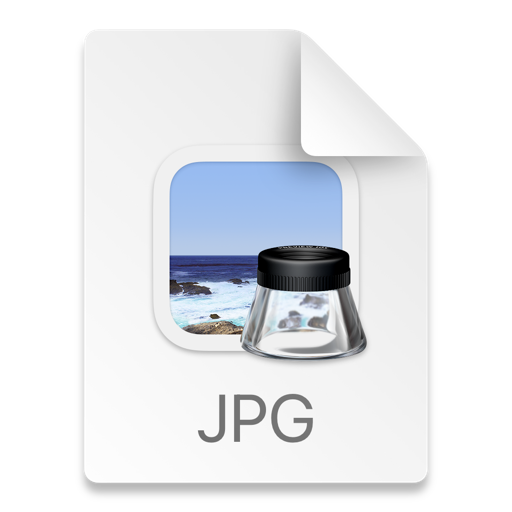
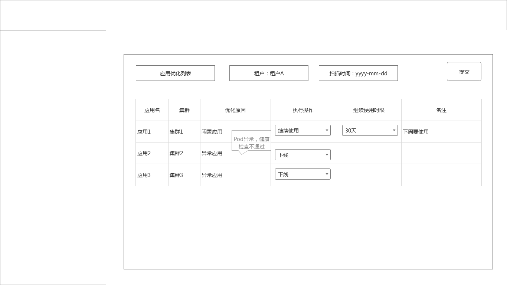
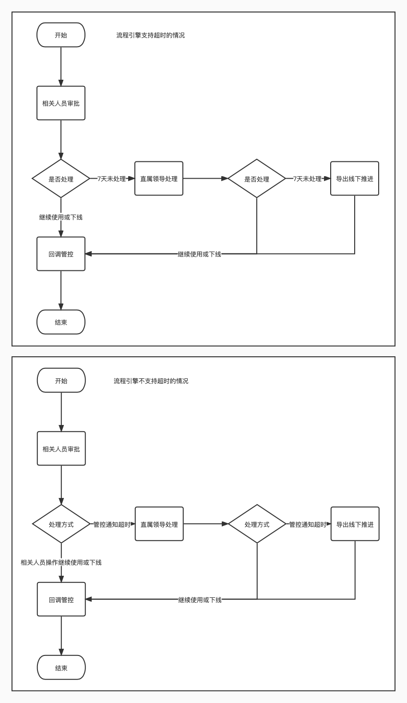

# 测试环境应用使用规范

## 概要设计

- 1年未更新过 或 7天内无流量 的应用标记为 "异常应用"
- 异常应用发起确认流程，由相关人员确认清理还是继续使用
- 相关人员的确定（如何从应用关联）
- 流程7天内无处理操作，升级到直属领导
- 继续7天内无处理操作，导出数据线下推进

### 整体处理流程

](服务下线流程.jpg)

## 详细设计

### models & tables

- 优化任务：每次任务需要生成一条任务记录

```go
package models

// ServiceOptimizeTask 应用优化任务
type ServiceOptimizeTask struct {
	BatchId           string // uk
	Env               string // 环境：test
	ServiceCount      uint32 // 获取到的应用数量
	ServiceDealCount  uint32 // 已处理
	ServiceClearCount uint32 // 冻结数量
	ServiceRenewCount uint32 // 继续使用的数量
	// ...... ID、时间、人员、deleted基本属性
}
```

- 优化记录：每个选取到的应用的处理记录

```go
package models

import "time"

// ServiceOptimizeRecord 应用优化记录
type ServiceOptimizeRecord struct {
	TaskId       string    // 任务id
	ServiceId    uint32    // 应用ID
	FlowId       uint32    // 流程ID
	FlowStatus   uint16    // 流程处理状态：初始化 - 一级审批 - 二级审批 - 线下推进 - 完成
	OptimizeType uint8     // 优化类型：冻结、扩容、缩容
	DealBy       uint32    // 处理人
	DealByName   uint32    // 处理人姓名
	DealType     uint8     // 处理类型：处理、忽略
	DealReason   string    // 处理原因(忽略时必须填入)
	DealAt       time.Time // 处理时间
	DealStatus   uint16    // 处理状态：待执行、执行中、完成
	// ...... ID、时间、人员、deleted基本属性
}
```

- 优化忽略记录

```go
package models

import "time"

// ServiceOptimizeIgnore 应用优化忽略记录
type ServiceOptimizeIgnore struct {
	TaskId          string    // 任务id
	RecordId        string    // 记录id
	ValidityBeginAt time.Time // 生效开始时间
	ValidityDays    uint16    // 有效时间（时间范围内不再进入进化可选项中）
	// ...... ID、时间、人员、deleted基本属性
}
```

### 异常应用标记

    使用云原生任务，周期性执行：每天凌晨5点？()

为了防止异常数据过多，需要按组（比如以租户为key）多个应用同一页面处理，处理中的应用在第二次筛选时忽略掉。

同时对于瞬时值，需要多轮采样并获取结果，避免中间状态导致的错误选中。

#### 【异常应用】无调度的Pod应用

```
kube_pod_status_scheduled{cluster="xy_test_cluster",app_name!="",tenant_cd!="",env_cd!="",condition="true"} == 0
```

#### 【异常应用】非正常状态Pod

```
kube_pod_status_phase{cluster="K8S_CLUSTER_NAME",app_name!="",tenant_cd!="",env_cd!="",phase != "Running",phase != "Succeeded" } == 1
```

value==1 表示 phase 等于当前状态

#### 【异常应用】Pod未就绪

可能的原因是健康检查未通过

```
kube_pod_status_ready{cluster="K8S_CLUSTER_NAME",app_name!="",tenant_cd!="",env_cd!="",condition="true" } == 0
```

#### 【异常应用】Pod重启次数过多(可能一直在重启)

```
(kube_pod_container_status_restarts_total{cluster="K8S_CLUSTER_NAME",app_name!="",tenant_cd!="",env_cd!=""}) - (kube_pod_container_status_restarts_total{cluster="K8S_CLUSTER_NAME",app_name!="",tenant_cd!="",env_cd!=""} offset %dd)
```

counter类型的值，通过两个时间点的瞬时值差值得到重启的次数

#### 【空闲应用】无进|出流量

```
cloud_pod_network_in_bytes_per_second{cluster="K8S_CLUSTER_NAME",app_name!="",node!="",tenant_cd!="",env_cd!=""}

avg_over_time(cloud_pod_network_in_bytes_per_second{cluster="K8S_CLUSTER_NAME",app_name!="",node!="",tenant_cd!="",env_cd!=""}[1h])
```

两个值都是瞬时值，通过求平均或者两点的差值得到结果

#### 后台界面

管控后台添加应用优化任务、记录列表，展示相关信息。

### 相关人员获取

规则？：

- 应用的创建者
- 应用所在逻辑集群所属的租户
- 应用所属的租户

### 邮件通知（测试环境）

    避免直接走流程，先邮件通知，并附上相关连接，用户可以通过连接进入直接处理相关应用的操作：冻结、继续使用（需要提供相应能力，见下文）

邮件通知（附处理链接）后，用户可以直接处理，对于没有处理的应用，在下一轮筛选到时，再走标准流程处理。



或者每一行可以单独处理，行尾添加提交按钮（状态为未处理的情况）

### itsm流程

    7天后未处理会升级到直属领导，是否需要在之前发出相关提示（如5天未处理邮件通知提示相关信息）？
    获取到（未处理）"异常"应用及其相关人员后，触发itsm流程

流程如下：



如果itsm流程引擎支持节点审批超时，则采用第一个流程，如果不支持，则由管控触发流程的进一步走向。

### itsm回调

    在审批节点做出决策时，需回调管控，由管控记录并执行

#### 应用清理

清理步骤如下：

- 归档应用数据（设置有效期）: 应用部署yaml文件，配置信息，域名信息，有状态应用还需要标记对应的pv信息
- 删除应用：应用冻结
- 回收资源

#### 应用继续使用

    对于无流量应用，继续使用期限应小于无更新应用（如分别为1个月，3个月）

- 需选择继续使用的时限（落库），在该时限内，即使满足"异常"应用的条件，也不会被选择到待优化应用列表

### 注意事项

- 整个过程中，应处理服务已被删除的情况（如已经在走流程了，感知到服务已删除，则终结流程）
