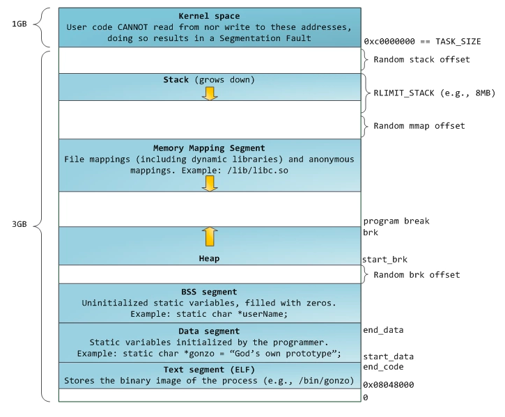
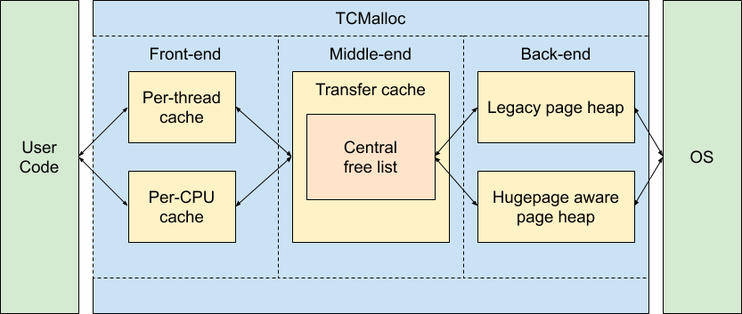
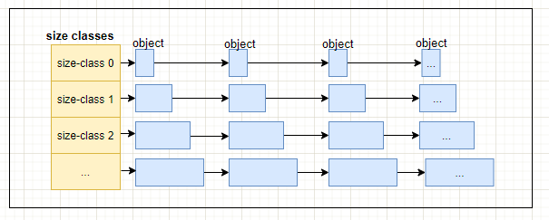
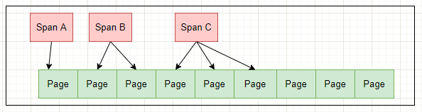
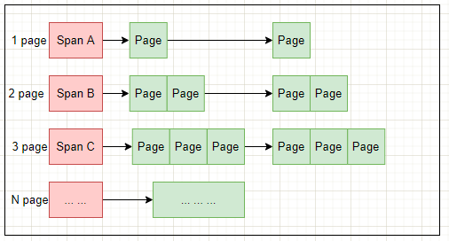
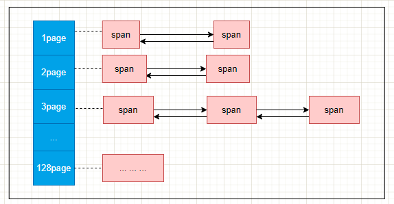
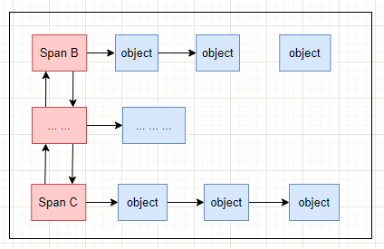
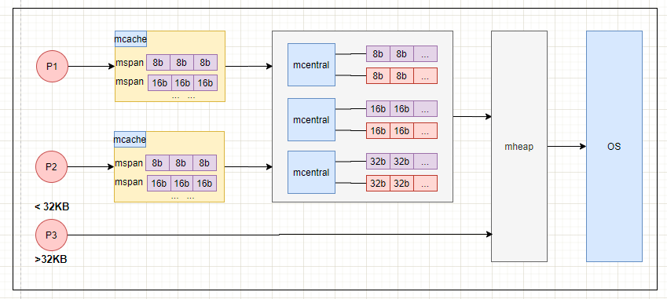

# Go

- [数据库](database.md)
- [redis](redis.md)
- [go语言基础](go.md)

## 内存模型

    Go中虽然也分堆和栈，但是实际使用没什么区别。
    也没有直接的向堆申请内存的方法

### Linux系统内存

虚拟内存: 程序运行进程的总大小可以超过实际可用的物理内存的大小。每个进程都可以有自己独立的虚拟地址空间。然后通过CPU和MMU把虚拟内存地址转换为实际物理地址.

- 好处
  - 它将内存看成是一个存储在磁盘上的地址空间的高速缓存，在内存中只保留了活动区域，可以根据需要在磁盘和内存间来回传送数据，高效使用内存。
  - 它为每个进程提供了一致的地址空间，简化了存储的管理。
  - 对进程起到保护作用，不被其他进程地址空间破坏，因为每个进程的地址空间都是相互独立

- 进程的内存



最高位的1GB是linux内核空间，用户代码不能写，否则触发段错误。下面的3GB是进程使用的内存。

- Kernel space：linux内核空间内存
- Stack：进程栈空间，程序运行时使用。它向下增长，系统自动管理
- Memory Mapping Segment：内存映射区，通过mmap系统调用，将文件映射到进程的地址空间，或者匿名映射。
- Heap：堆空间。这个就是程序里动态分配的空间。linux下使用malloc调用扩展（用brk/sbrk扩展内存空间），free函数释放（也就是缩减内存空间）
- BSS段：包含未初始化的静态变量和全局变量
- Data段：代码里已初始化的静态变量、全局变量
- Text段：代码段，进程的可执行文件

### TCMalloc

    Go中的内存分配算法来源于tcmalloc

    参考 https://www.cnblogs.com/jiujuan/p/13869547.html

tcmalloc(Thread Cache) 是google开发的内存分配算法库

提供了很多优化:
- TCMalloc用固定大小的page(页)来执行内存获取、分配等操作。这个特性跟Linux物理内存页的划分有同样的道理。
- TCMalloc用固定大小的对象，比如8KB，16KB 等用于特定大小对象的内存分配，这对于内存获取或释放等操作都带来了简化的作用。
- TCMalloc还利用缓存常用对象来提高获取内存的速度。
- TCMalloc还可以基于每个线程或者每个CPU来设置缓存大小，这是默认设置。
- TCMalloc基于每个线程独立设置缓存分配策略，减少了多线程之间锁的竞争。



- Front-end： 
它是一个内存缓存，提供了快速分配和重分配内存给应用的功能。它主要有2部分组成：Per-thread cache 和 Per-CPU cache。

- Middle-end：
职责是给Front-end提供缓存。也就是说当Front-end缓存内存不够用时，从Middle-end申请内存。它主要是 Central free list 这部分内容。

- Back-end：
这一块是负责从操作系统获取内存，并给Middle-end提供缓存使用。它主要涉及 Page Heap 内容。

TCMalloc将整个虚拟内存空间划分为n个同等大小的Page。将n个连续的page连接在一起组成一个Span。
PageHeap向OS申请内存，申请的span可能只有一个page，也可能有n个page。

ThreadCache内存不够用会向CentralCache申请，CentralCache内存不够用时会向PageHeap申请，PageHeap不够用就会向OS操作系统申请。

#### TCMalloc中的概念

- Page

操作系统对内存管理的单位，TCMalloc也是以页为单位管理内存，但是TCMalloc中Page大小是操作系统中页的倍数关系。2，4，8 ....

- Span

Span 是PageHeap中管理内存页的单位，它是由一组连续的Page组成，比如2个Page组成的span，多个这样的span就用链表来管理。当然，还可以有4个Page组成的span等等。

- ThreadCache

ThreadCache是每个线程各自独立拥有的cache，一个cache包含多个空闲内存链表（size classes），每一个链表（size-class）都有自己的object，每个object都是大小相同的。

- CentralCache

CentralCache是当ThreadCache内存不足时，提供内存供其使用。它保持的是空闲块链表，链表数量和ThreadCache数量相同。ThreadCache中内存过多时，可以放回CentralCache中。

- PageHeap

PageHeap保存的也是若干链表，不过链表保存的是Span（多个相同的page组成一个Span）。CentralCache内存不足时，可以从PageHeap获取Span，然后把Span切割成object。

- 小对象内存分配 ThreadCache

TCMalloc 定义了很多个size class，每个size class都维护了一个可分配的的空闲列表，空闲列表中的每一项称为一个object（如下图），同一个size-class的空闲列表中每个object大小相同。
在申请小内存时(小于256K)，TCMalloc会根据申请内存大小映射到某个size-class中。
比如，申请0到8个字节的大小时，会被映射到size-class1中，分配8个字节大小；申请9到16字节大小时，会被映射到size-class2中，分配16个字节大小….以此类推。



上面每一个object都是 N bytes。用于Thread Cache小内存分配。
这个就组成了每一个ThreadCache的free list，thread可以从各自的free list获取对象，不需要加锁，所以速度很快。

如果ThreadCache的free list为空呢？那就从CentralCache中的CentralFreeList中获取若干个object到ThreadCache对应的size class列表中，然后在取出其中一个object返回。
如果CentralFreeList中的object不够用了呢？那CentralFreeList就会向PageHeap申请一连串由Span组成页面，并将申请的页面切割成一系列的object之后，再将部分object转移给ThreadCache。
如果PageHeap也不够用了呢？那就向OS操作系统申请内存。
从上面论述可以看出，这也是一个多级缓存思想的应用。

当申请的内存大于256K时，不在通过ThreadCache分配，而是通过PageHeap直接分配大内存。

- 大对象内存分配 PageHeap

PageHeap负责向操作系统申请内存。

tcmalloc也是基于页的分配方式，即每次申请至少一页（page）的内存大小。tcmalloc中一页大小为8KB(默认，可设置)，多数linux中一页为4KB，tcmallo的一页是linux一页大小的2倍。

PageHeap申请内存时按照页申请，但它管理分配好的page内存时的基本单位是Span，Span对象代表了连续的页。如下图所示：





PageHeap中是如何组织Span，如下图



- Middle end-Central Free List

CentralFreeList是CentralCahe中，它的作用就是从PageHeap中取出部分Span，然后按照预定大小将其拆分成固定大小的object，提供给ThreadCache使用。



### golang内存分配中的概念

- mspan

mspan跟tcmalloc中的span相似，它是golang内存管理中的基本单位，也是由页组成的，每个页大小为8KB，与tcmalloc中span组成的默认基本内存单位页大小相同。mspan里面按照8*2n大小（8b，16b，32b .... ），每一个mspan又分为多个object。
就连名字也很像，mspan中的m应该是memory的第一个字母。

- mcache
mcache跟tcmalloc中的ThreadCache相似，ThreadCache为每个线程的cache，同理，mcache可以为golang中每个Processor提供内存cache使用，每一个mcache的组成单位也是mspan。

- mcentral

mcentral跟tcmalloc中的CentralCache相似，当mcache中空间不够用，可以向mcentral申请内存。可以理解为mcentral为mcache的一个“缓存库”，供mcaceh使用。它的内存组成单位也是mspan。
mcentral里有两个双向链表，一个链表表示还有空闲的mspan待分配，一个表示链表里的mspan都被分配了。

- mheap

mheap跟tcmalloc中的PageHeap相似，负责大内存的分配。当mcentral内存不够时，可以向mheap申请。那mheap没有内存资源呢？跟tcmalloc一样，向OS操作系统申请。
还有，大于32KB的内存，也是直接向mheap申请。



### 堆和栈

- 堆空间通常比栈大
- 栈存放栈帧，随着函数的调用和返回，系统自动分配和释放，堆内存由程序员（无runtime）或者GC程序管理
- 系统自动处理栈空间，速度更快
- 堆内存分配释放可能造成碎片，需要整理。栈内存时连续的，不会降低程序效率。

### 垃圾回收

常见的GC算法

- 引用计数：每一个对象都有一个关联的引用计数 —— 对该对象的活跃引用的数量。如果对象的引用计数是零，那么它就是垃圾。引用计数不能处理循环应用，所以仅用作解释GC的工作模式
- 标记清理（根搜索算法）：从根变量开始遍历标记所有引用的对象，没有被标记的清理掉，几乎所有GC都使用根搜索算法
- 分代收集：根据对象的特征将内存分成多个区域采用不同的收集策略（如java）

#### Go的三色标记法

    对比java的分代收集，三色法的综合性应该稍差，但是不会浪费内存（复制算法会开辟两块内存）
    新版的go STW整体控制在1ms以内，性能已经比较理想了。

Go中使用三色标记的根搜索法清理垃圾，步骤如下：

- 1、初始状态下所有对象都是白色的
- 2、从根节点开始遍历所有对象，将遍历到的对象置为灰色
- 3、遍历灰色对象，将这些灰色对象置为黑色，并把灰色对象引用的对象置为灰色
- 4、循环3，知道所有灰色对象全部变为黑色
- 5、通过写屏障检测对象变化，重复上面的操作
- 6、收集所有白色对象

根对象从哪里来：

- 全局变量
- goroutine执行栈引用的对象

#### STW（stop the world）

避免GC过程中，对象引用发生变化时造成GC结果错误，需要STW，stp期间会停止所有正在运行的协程

可能的错误：

- 1、GC过程中，有灰色对象的引用被断开，变成root对象实际不可达的节点，这种本应该清理却没被清理
- 2、GC过程中，黑色对象新增了对白色对象的引用，不应该被清理的却清理掉了

对于1，只是造成无用对象的收集延迟，对程序没有太大影响，但是对于2，会造成对象丢失，发生致命错误，这时候就需要写屏障的介入。

#### 写屏障

    写屏障实际是指赋值器的写屏障（赋值器屏障）

对象丢失的条件：

- 条件1：黑色节点A新增了指向了白色节点B的引用
- 条件2：B除了A之外，没有其他灰色节点的引用

以上两点同时满足时，会造成对象丢失，只需要破坏任一条件条件即可

- Dijistra写屏障（强三色不变性）

黑色节点不允许引用白色节点，如果要新增黑色节点对白色节点的引用，将白色节点改为灰色

```go
// 灰色赋值器
func DijkstraWritePointer(slot *unsafe.Pointer, ptr unsafe.Pointer) {
shade(ptr) // shade(ptr) 会将尚未变成灰色或黑色的指针 ptr 标记为灰色
*slot = ptr
}
```

- Yuasa写屏障（弱三色不变性）

黑色节点允许引用白色节点，但是该白色节点有其他灰色节点间接的引用（确保不会被遗漏） 当白色节点被删除了一个引用时，悲观地认为它一定会被一个黑色节点新增引用，所以将它置为灰色

```go
// 黑色赋值器
func YuasaWritePointer(slot *unsafe.Pointer, ptr unsafe.Pointer) {
shade(*slot) // shade(*slot) 会先将 *slot 标记为灰色
*slot = ptr
}
```

- Go1.8开始使用混合写屏障（结合以上两种）

```go
// 混合写屏障
func HybridWritePointerSimple(slot *unsafe.Pointer, ptr unsafe.Pointer) {
shade(*slot)
shade(ptr)
*slot = ptr
}
```

在 Go 1.8 之前，为了减少写屏障的成本，Go 选择没有启用栈上写操作的写屏障， 赋值器总是可以通过将一个单一的指针移动到某个已经被扫描后的栈， 从而导致某个白色对象被标记为灰色进而隐藏到黑色对象之下，进而需要对栈的重新扫描， 甚至导致栈总是灰色的，因此需要 STW。

混合写屏障为了消除栈的重扫过程，因为一旦栈被扫描变为黑色，则它会继续保持黑色， 并要求将对象分配为黑色。

#### stw发生在什么时候

根据以上分析，会发生在两个阶段：

- 第一次STW会准备根对象的扫描，启动写屏障
- 第二次STW会重新扫描部分根对象, 禁用写屏障

#### 什么时候会出发GC

- 手动 `runtime.GC()`
- 系统定时调用
- 系统根据分配内存时的步调算法

#### 逃逸分析

    Go在编译时，通过逃逸分析确定对象应该在堆上分配还是栈上分配
    栈上无GC，效率优于堆

- 指针逃逸
- 闭包引用逃逸
- 动态类型逃逸
- 栈空间满逃逸

## CSP模型

    go语言座右铭：“使用通信来共享内存，而不是通过共享内存来通信”
    CSP时1978年一篇论文提出的技术，即通信顺序进程
    不过当时作者认为CSP不适合作为编程语言实现
    然而CSP在Go中是非常重要的组成部分（非CSP完全实现），提供了元语支持

传统多线程的做法：通过锁限制堆临界区资源的访问

CSP：基于通道

## 协程调度

### GPM模型

- G：GoRoutine，每个go关键字都会创建一个协程
- P：Processor，Go中的处理器，维护了Goroutine队列，默认为数量为cpu核数，可用GOMAXPROCS()设置
- M：Machine，工作线程，数量为cpu核数
- Sched：调度器

工作方式：

Go协程为什么高效？

Linux参数如何调优

### 调度策略

### chan

```go
package runtime
import (
	"unsafe"
)

type hchan struct {
	qcount   uint           // 队列中的总元素个数
	dataqsiz uint           // 环形队列大小，即可存放元素的个数
	buf      unsafe.Pointer // 环形队列指针
	elemsize uint16         //每个元素的大小
	closed   uint32         //标识关闭状态
	elemtype *_type         // 元素类型
	sendx    uint           // 发送索引，元素写入时存放到队列中的位置
	recvx    uint           // 接收索引，元素从队列的该位置读出
	recvq    waitq          // 等待读消息的goroutine队列
	sendq    waitq          // 等待写消息的goroutine队列
	lock     mutex          //互斥锁，chan不允许并发读写
}
```

- 向 channel 写数据:
  - 若等待接收队列 recvq 不为空，则缓冲区中无数据或无缓冲区，将直接从 recvq 取出 G ，并把数据写入，最后把该 G 唤醒，结束发送过程。
  - 若缓冲区中有空余位置，则将数据写入缓冲区，结束发送过程。
  - 若缓冲区中没有空余位置，则将发送数据写入 G，将当前 G 加入 sendq ，进入睡眠，等待被读 goroutine 唤醒。
- 从 channel 读数据
  - 若等待发送队列 sendq 不为空，且没有缓冲区，直接从 sendq 中取出 G ，把 G 中数据读出，最后把 G 唤醒，结束读取过程。
  - 如果等待发送队列 sendq 不为空，说明缓冲区已满，从缓冲区中首部读出数据，把 G 中数据写入缓冲区尾部，把 G 唤醒，结束读取过程。
  - 如果缓冲区中有数据，则从缓冲区取出数据，结束读取过程。
  - 将当前 goroutine 加入 recvq ，进入睡眠，等待被写 goroutine 唤醒。
- 关闭 channel
  - 关闭 channel 时会将 recvq 中的 G 全部唤醒，本该写入 G 的数据位置为 nil。将 sendq 中的 G 全部唤醒，但是这些 G 会 panic。
    - panic 出现的场景还有：
    - 关闭值为 nil 的 channel
    - 关闭已经关闭的 channel
    - 向已经关闭的 channel 中写数据


## 数据结构

### slice

### map

###    

## context

## map 与 sync.map

## 调优
